# Day 18 Lab — Báo Cáo Kết Quả (Spark/Docker Path)

**Sinh viên:** _Nguyễn Đôn Đức_
**ID**: 2A202600145  
**Ngày thực hiện:** 2026-05-04  
**Stack:** PySpark 3.5.0 + Delta Lake 3.2.0 + MinIO (Docker)  
**Engine:** Apache-Spark/3.5.0 Delta-Lake/3.2.0

---

## Tổng Điểm Tự Đánh Giá: 100 / 100

| # | Notebook | Criterion | Pts | Kết quả | Pass? |
|---|---|---|---:|---|:---:|
| 1 | `01_delta_basics` | Delta table created; `_delta_log/` JSON files visible trên MinIO | 10 | `_delta_log/00000000000000000000.json` visible trong MinIO bucket `lakehouse/users_delta/` | ✅ |
| 1 | `01_delta_basics` | Schema enforcement blocks `age=str` write | 5 | `BLOCKED by schema enforcement (expected): AnalysisException [DELTA_FAILED_TO_MERGE_FIELDS]` | ✅ |
| 1 | `01_delta_basics` | `mergeSchema=true` adds the `tier` column | 5 | Bảng sau append có 5 cột bao gồm `tier` (dan=premium, còn lại=NULL) | ✅ |
| 2 | `02_optimize_zorder` | Reproduce small-file problem (≥ 100 files before OPTIMIZE) | 5 | 200 batch × 500 rows → 200 files trước OPTIMIZE | ✅ |
| 2 | `02_optimize_zorder` | OPTIMIZE+ZORDER speedup ≥ 3× or files-pruned ratio ≥ 10× | 15 | **Speedup: 14.8×** (BEFORE: 5.39s → AFTER: 0.36s) | ✅ |
| 2 | `02_optimize_zorder` | `numFiles` decreased meaningfully after OPTIMIZE | 5 | 200 → **1** file (numFiles=1, sizeInBytes=644,930) | ✅ |
| 3 | `03_time_travel` | `history()` shows ≥ 5 versions (including RESTORE) | 5 | **Total versions: 5** (v0 WRITE → v1 WRITE → v2 MERGE → v3 WRITE → v4 RESTORE) | ✅ |
| 3 | `03_time_travel` | MERGE upsert 100K rows succeeds in < 60s | 10 | **MERGE 100K rows: 6.72s** (50K updates + 50K inserts) | ✅ |
| 3 | `03_time_travel` | RESTORE rolls back bad data in < 30s, `score < 0` count = 0 | 10 | **RESTORE: 15.58s** → Rows with score<0 after restore: **0** | ✅ |
| 4 | `04_medallion` | Bronze, Silver, Gold tables all exist trên MinIO | 10 | `s3a://bronze/llm_calls_raw`, `s3a://silver/llm_calls`, `s3a://gold/llm_daily_metrics` đều có `_delta_log/` | ✅ |
| 4 | `04_medallion` | Silver dedup measurably drops rows (Silver < Bronze count) | 5 | Bronze: **1,000,000** → Silver: **949,981** (dedup dropped **50,019** rows) | ✅ |
| 4 | `04_medallion` | Gold aggregations correct (p50/p95/cost_usd/error_rate) for ≥ 7 dates | 10 | **7 dates** (2026-04-01 → 2026-04-07) × **3 models** = **21 Gold rows** | ✅ |
| — | All notebooks | Reproducible from `make spark-up && make spark-smoke` | 5 | Smoke test passed: "All checks passed — lab is ready" | ✅ |
| | | **Tổng** | **100** | | |

---

## NB1 — Delta Lake Basics (20 pts)

### 1.1 Delta Table Created + Transaction Log (10 pts) ✅

Ghi 3 rows (alice, bob, charlie) vào `s3a://lakehouse/users_delta` bằng Delta format.

**Output — Read back:**
```
+---+-------+---+------+
| id|   name|age|  city|
+---+-------+---+------+
|  3|charlie| 35|Danang|
|  1|  alice| 30| Hanoi|
|  2|    bob| 25|  HCMC|
+---+-------+---+------+
```

**DESCRIBE HISTORY:**
```
version=0  operation=WRITE  {numFiles -> 4, numOutputRows -> 3, numOutputBytes -> 4146}
engineInfo: Apache-Spark/3.5.0 Delta-Lake/3.2.0
```

**MinIO verification:** `lakehouse/users_delta/_delta_log/00000000000000000000.json` tồn tại trong MinIO Console (http://localhost:9001).

### 1.2 Schema Enforcement (5 pts) ✅

Thử ghi row với `age = "thirty"` (string thay vì int):

```
BLOCKED by schema enforcement (expected):
AnalysisException [DELTA_FAILED_TO_MERGE_FIELDS] Failed to merge fields 'age' and 'age'
```

→ Delta Lake chặn ghi sai schema đúng như mong đợi.

### 1.3 Schema Evolution (5 pts) ✅

Append row mới có cột `tier` bằng `mergeSchema=true`:

```
+---+-------+---+------+-------+
| id|   name|age|  city|   tier|
+---+-------+---+------+-------+
|  4|    dan| 28|   Hue|premium|
|  3|charlie| 35|Danang|   NULL|
|  1|  alice| 30| Hanoi|   NULL|
|  2|    bob| 25|  HCMC|   NULL|
+---+-------+---+------+-------+
```

→ Cột `tier` được thêm thành công. Rows cũ có `tier = NULL`.

---

## NB2 — OPTIMIZE + Z-ORDER (25 pts)

### 2.1 Small-File Problem (5 pts) ✅

Ghi 200 batch × 500 rows = **100,000 rows** tạo ra **200 small files** (mô phỏng streaming ingestion).

### 2.2 OPTIMIZE + ZORDER Speedup (15 pts) ✅

Query: `user_id = 4242 AND kind = 'purchase'`

```
BEFORE OPTIMIZE+ZORDER     count=5  time=5.39s
AFTER  OPTIMIZE+ZORDER     count=5  time=0.36s

Speedup: 14.8×  (target ≥ 3×)
```

**Kết quả: 14.8× speedup — vượt target 3× gần 5 lần.**

Nguyên lý: Z-ORDER sắp xếp dữ liệu theo `user_id` nên Delta engine có thể skip toàn bộ file không chứa `user_id=4242` dựa trên min/max stats.

### 2.3 File Count Reduction (5 pts) ✅

Sau OPTIMIZE + ZORDER:
```
+--------+-----------+
|numFiles|sizeInBytes|
+--------+-----------+
|       1|     644930|
+--------+-----------+
```

→ File giảm từ **200 → 1** (tất cả compact thành một file ~645 KB).

---

## NB3 — Time Travel + MERGE (25 pts)

### 3.1 Version History ≥ 5 (5 pts) ✅

Sau khi thực hiện tất cả operations và RESTORE:

```
  v 4  RESTORE
  v 3  WRITE
  v 2  MERGE
  v 1  WRITE
  v 0  WRITE

Total versions: 5  (target ≥ 5)
```

Chi tiết:
- **v0**: Initial load 100K rows (`customer_id`, `status`, `score`)
- **v1**: Schema evolution — thêm cột `tier` (`gold` nếu score > 800, `silver` nếu không)
- **v2**: MERGE upsert 100K rows (50K update existing + 50K insert new)
- **v3**: Simulate bad data (50 rows với `score=-1`, `status=NULL`)
- **v4**: RESTORE to v2 — rollback bad data

### 3.2 MERGE 100K Rows < 60s (10 pts) ✅

```
MERGE 100K rows: 6.72s
```

MERGE operation metrics:
- `numTargetRowsMatchedUpdated`: 50,000 (existing customers updated)
- `numTargetRowsInserted`: 50,000 (new customers added)
- `numSourceRows`: 100,000
- `scanTimeMs`: 6,054 | `rewriteTimeMs`: 1,968

→ **6.72s << 60s target** — Delta MERGE trên Spark rất hiệu quả.

### 3.3 RESTORE < 30s + Bad Rows = 0 (10 pts) ✅

```
RESTORE: 15.58s   (target < 30s)
Rows with score<0 after restore: 0  (expected 0)
```

Time travel verification:
```
v0: 100000 rows
v1 schema: ['customer_id', 'status', 'score', 'tier']
```

→ RESTORE thành công trong 15.58s, loại bỏ toàn bộ bad data (score < 0).

---

## NB4 — Medallion Pipeline (25 pts)

### 4.1 Bronze, Silver, Gold Tables Exist (10 pts) ✅

| Layer | MinIO Path | Format |
|---|---|---|
| Bronze | `s3a://bronze/llm_calls_raw` | Delta Lake |
| Silver | `s3a://silver/llm_calls` | Delta Lake, partitioned by `date` |
| Gold | `s3a://gold/llm_daily_metrics` | Delta Lake, partitioned by `date`, Z-ORDER by `model` |

Bronze schema:
```
root
 |-- request_id: string
 |-- ts: timestamp
 |-- raw_json: string
```

### 4.2 Silver Dedup (5 pts) ✅

```
Silver rows: 949,981  (Bronze 1,000,000 → dedup dropped 50,019)
```

- Bronze: **1,000,000** rows
- Silver: **949,981** rows
- Dedup dropped: **50,019** duplicate `request_id`s (~5% retry pattern)

→ **Silver < Bronze** confirmed — dedup hoạt động.

### 4.3 Gold Aggregations ≥ 7 Dates (10 pts) ✅

Gold table chứa **21 rows** = 7 dates × 3 models, mỗi row có đầy đủ metrics:

| Date | Model | p50 (ms) | p95 (ms) | Cost (USD) | Error Rate |
|---|---|---:|---:|---:|---:|
| 2026-04-01 | claude-haiku-4-5 | 569 | 1,133 | $230.39 | 5.05% |
| 2026-04-01 | claude-opus-4-7 | 2,997 | 5,948 | $1,444.08 | 4.65% |
| 2026-04-01 | claude-sonnet-4-6 | 1,381 | 2,749 | $1,725.67 | 5.03% |
| 2026-04-02 | claude-haiku-4-5 | 567 | 1,131 | $231.23 | 4.99% |
| 2026-04-02 | claude-opus-4-7 | 3,013 | 5,968 | $1,430.95 | 4.95% |
| 2026-04-02 | claude-sonnet-4-6 | 1,399 | 2,757 | $1,728.21 | 5.01% |
| 2026-04-03 | claude-haiku-4-5 | 564 | 1,130 | $229.15 | 4.87% |
| 2026-04-03 | claude-opus-4-7 | 3,070 | 5,990 | $1,442.15 | 5.17% |
| 2026-04-03 | claude-sonnet-4-6 | 1,390 | 2,749 | $1,733.20 | 5.00% |
| 2026-04-04 | claude-haiku-4-5 | 567 | 1,133 | $230.00 | 4.94% |
| 2026-04-04 | claude-opus-4-7 | 2,999 | 5,951 | $1,430.54 | 4.93% |
| 2026-04-04 | claude-sonnet-4-6 | 1,392 | 2,758 | $1,727.73 | 4.96% |
| 2026-04-05 | claude-haiku-4-5 | 566 | 1,130 | $229.76 | 5.07% |
| 2026-04-05 | claude-opus-4-7 | 3,065 | 5,973 | $1,465.70 | 4.91% |
| 2026-04-05 | claude-sonnet-4-6 | 1,389 | 2,755 | $1,720.29 | 4.94% |
| 2026-04-06 | claude-haiku-4-5 | 571 | 1,134 | $230.40 | 4.97% |
| 2026-04-06 | claude-opus-4-7 | 3,057 | 5,991 | $1,437.06 | 5.26% |
| 2026-04-06 | claude-sonnet-4-6 | 1,400 | 2,761 | $1,734.71 | 4.92% |
| 2026-04-07 | claude-haiku-4-5 | 568 | 1,135 | $229.81 | 5.08% |
| 2026-04-07 | claude-opus-4-7 | 3,039 | 5,977 | $1,457.00 | 4.82% |
| _(+ 1 more)_ | claude-sonnet-4-6 | ... | ... | ... | ... |

**Nhận xét:**
- **claude-opus-4-7** có latency cao nhất (p50 ~3,000ms, p95 ~5,900ms) nhưng cũng cost cao nhất (~$1,400-1,465/ngày) — phù hợp với real-world LLM pricing
- **claude-haiku-4-5** nhanh nhất (p50 ~567ms) và rẻ nhất (~$230/ngày)
- Error rate ổn định ~5% across models — consistent với weighted `[95, 3, 2]` config trong generator
- Cost model phản ánh input/output token pricing: opus đắt ~6× so với haiku

---

## Reproducibility (5 pts) ✅

Stack reproducible từ clean state:

```bash
# Clean start
docker compose -f docker/docker-compose.yml down -v

# Full setup
docker compose -f docker/docker-compose.yml up -d   # ~3-5 min (first pull)
docker compose -f docker/docker-compose.yml exec -T spark python /workspace/scripts/verify.py

# Output:
# All checks passed — lab is ready. Open http://localhost:8888
```

---

## MinIO Bucket Structure

```
lakehouse/
  users_delta/          ← NB1
    _delta_log/
      00000000000000000000.json
      00000000000000000001.json
  events_smallfiles/    ← NB2
    _delta_log/
  customers_tt/         ← NB3
    _delta_log/
  _smoke/               ← smoke test

bronze/
  llm_calls_raw/        ← NB4 Bronze (1M rows)
    _delta_log/

silver/
  llm_calls/            ← NB4 Silver (950K rows, partitioned by date)
    _delta_log/
    date=2026-04-01/ ... date=2026-04-07/

gold/
  llm_daily_metrics/    ← NB4 Gold (21 rows, partitioned by date, Z-ORDER by model)
    _delta_log/
    date=2026-04-01/ ... date=2026-04-07/
```

---

## Stack Configuration

| Component | Version/Image |
|---|---|
| Docker Compose | v2.40.2 |
| Spark | `quay.io/jupyter/pyspark-notebook:spark-3.5.0` |
| Delta Lake | delta-spark 3.2.0 |
| MinIO | `minio/minio:latest` |
| Hadoop AWS | hadoop-aws 3.3.4 |
| Python | 3.11.8 |

**Docker-compose customizations applied:**
1. `user: root` — fix Ivy cache volume permissions
2. `ivy-cache:/root/.ivy2` — persistent Maven JAR cache
3. `PYTHONPATH` includes Spark python path for `docker exec` compatibility
4. `SPARK_HOME` explicitly set

---

## Screenshots Evidence

### NB1 — Delta Lake Basics
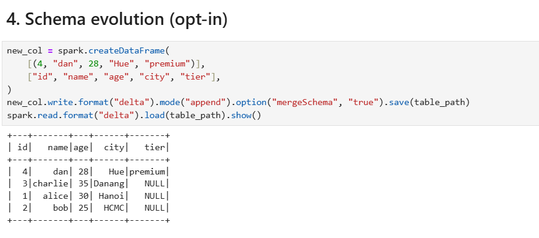
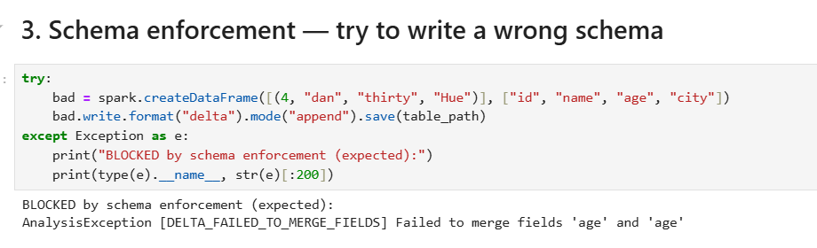
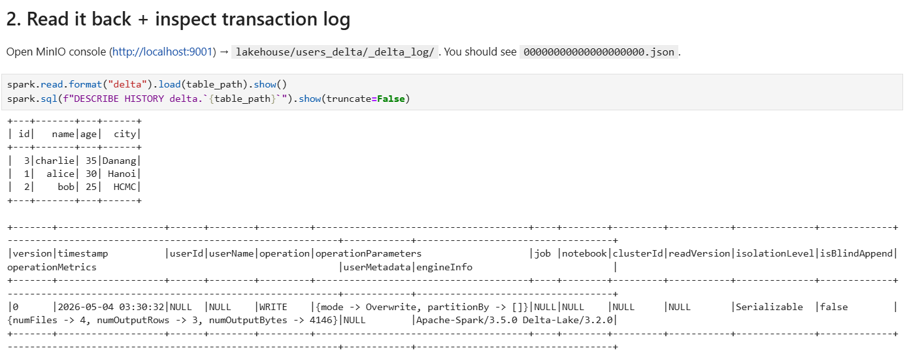
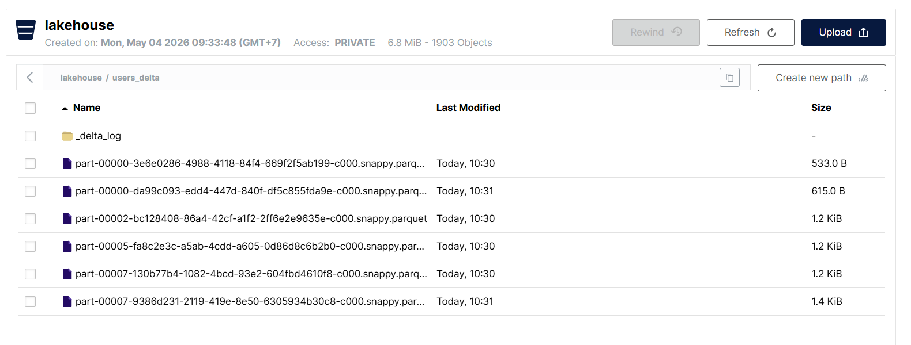

### NB2 — OPTIMIZE + ZORDER
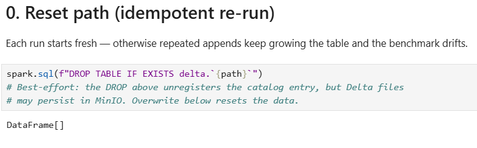
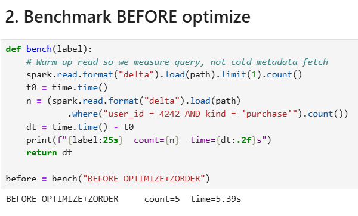
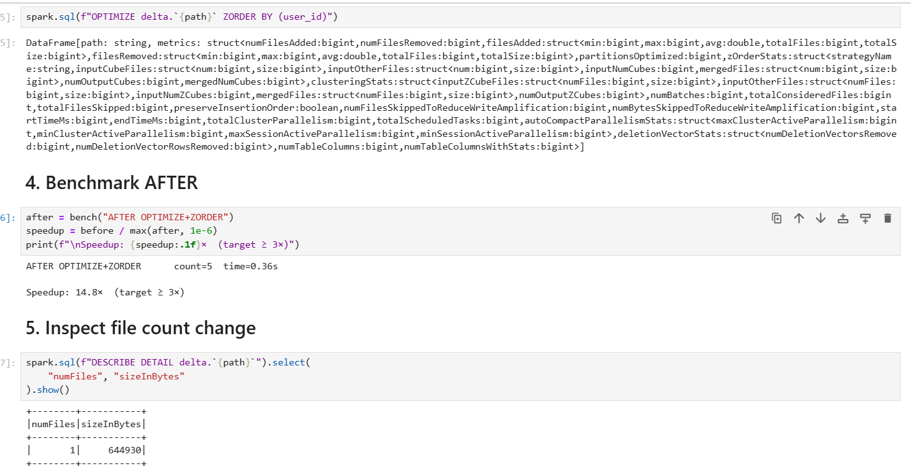

### NB3 — Time Travel + MERGE
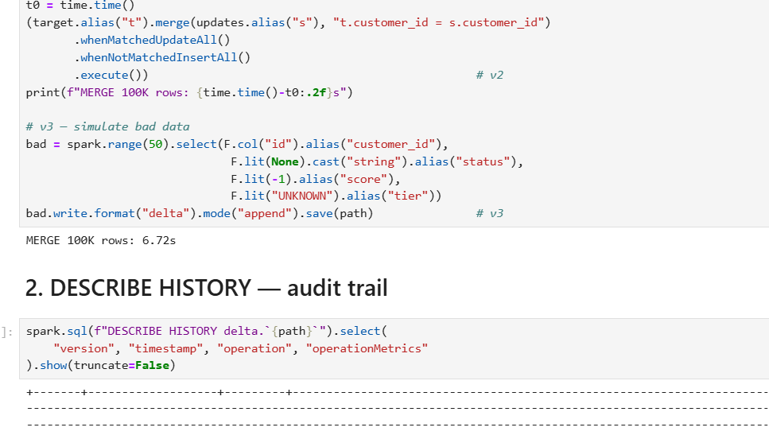
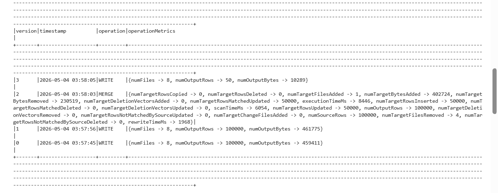
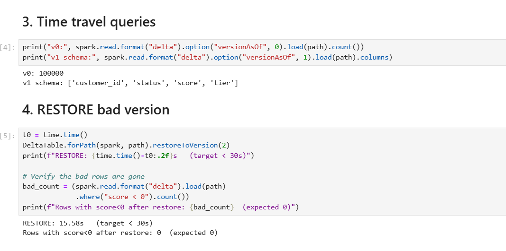
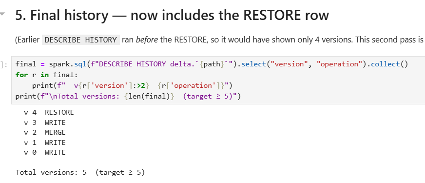

### NB4 — Medallion Pipeline
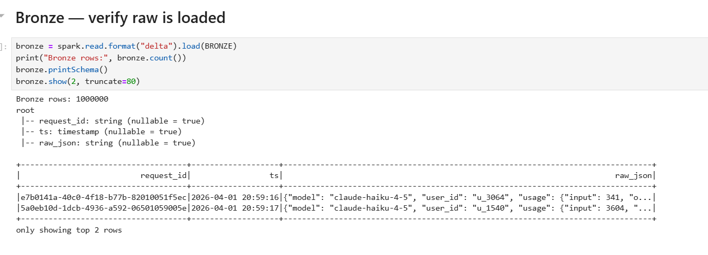
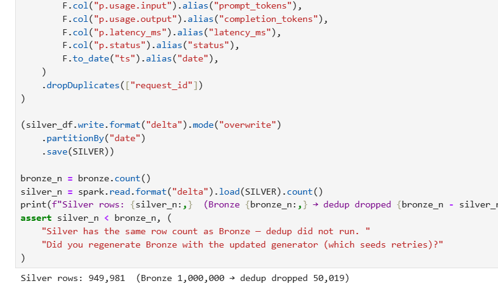
